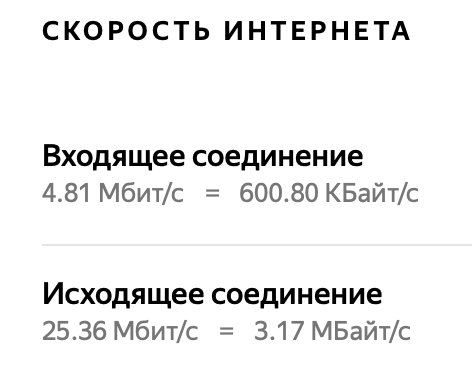
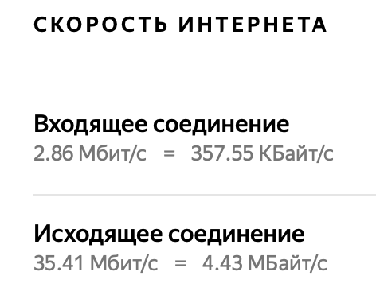

# gwg - менеджер Wireguard Server

---

## Для чего нужен

**gwg** - утилита командной строки для автоматического конфигурирования  и администрирования wireguard-сервера.
Поддерживает такие фунции как:

1) Автоматическая настройка конфигурации wireguard server;
2) Автоматическое изменение конфигурации сервера при добавлении пользователя;
3) Автоматическое изменение конфигурации сервера при удалении пользователя;
4) Автоматическое изменение конфигурации сервера при блокировке/разблокировке пользователя;
5) Просмотр состояния сервера через стандартную утилиту wg show;
6) Просмотр подробной статистики на основе стандартной утилиты wg show dump;
7) Создание общих правил для управления (ограничения скорости) входящим трафиком;
8) Создание правил для управления (ограничения скорости) входящим трафиком для каждого пользователя.

## Поддерживаемые платформы

- Любой дистрибутив linux на основе Debian.

## Установка

- Скачать архив с [желаемой](https://github.com/PavelMilanov/gwg/releases) версией и поддерживаемой архитектурой:

```bash
wget https://github.com/PavelMilanov/gwg/releases/download/v0.2.6.1/gwg.linux_amd64.tar
```

- Распаковать архив:

```bash
tar -C /usr/bin/ -xvf gwg.linux_amd64.tar
```

- Запустить установку:

```bash
/usr/bin/gwg init
```

## Обновление

- Распаковать архив:

```bash
rm /usr/bin/gwg && tar -C /usr/bin/ -xvf gwg.linux_amd64.tar
```

## Базовое  использование

### Просмотр общего функионала

- Синтаксис: `gwg -h`

```bash
gwg -h
Описание: gwg - cli-менеджер wireguard:

gwg show    - просмотр состояния wireguard-сервера.
gwg stat    - просмотр подробной статистики wireguard-сервера. 
gwg add     - добавления пользователя.
gwg remove  - удаление пользователя.
gwg block   - блокировка пользователя.
gwg unblock - разблокировка пользователя.
gwg tc      - модуль управления трафиком. (По-умолчанию выключен).
gwg ssp     - режим прокси-сервера. (По-умолчанию выключен).

Помощь: gwg <command> -h
```

### Просмотр состояния подключений

- Синтаксис: `gwg show`

```bash
gwg show

interface: wg0
  public key: 9zsArCzVC7kBWtvSkF4HBxSGlOvFU0StZSNvrXwVbAM=
  private key: (hidden)
  listening port: 51830

peer: 68upH1Bn0h1xy+Nuj61qtYRBGummuGBA2cU12xxbHiw=
  endpoint: 192.168.1.4:58082
  allowed ips: 10.0.0.2/32
  latest handshake: 15 minutes, 40 seconds ago
  transfer: 644.26 KiB received, 9.11 MiB sent
```

### Просмотр подробной статистики

- Синтаксис: `gwg stat`

```bash
gwg stat
1) User: test, Ip: 10.0.0.2/32 , Resieve: 659724, Sent: 9550044
```

### Добавление пользователя

- Синтаксис: `gwg add -name <alias>`

```bash
gwg add -name test2
____
[Peer]
# Name = test
PublicKey = 68upH1Bn0h1xy+Nuj61qtYRBGummuGBA2cU12xxbHiw=
AllowedIPs = 10.0.0.2/32

[Peer]
# Name = test2
PublicKey = 1RzC4fTiP84n1s9fKvh6YNQSgsFpdj3omlVD1JUwhSg=
AllowedIPs = 10.0.0.3/32
```

### Удаление пользователя

- Синтаксис: `gwg remove -name <alias>`

```bash
gwg remove -name test2
___
[Peer]
# Name = test
PublicKey = 68upH1Bn0h1xy+Nuj61qtYRBGummuGBA2cU12xxbHiw=
AllowedIPs = 10.0.0.2/32
```

### Блокировка пользователя

- Синтаксис: `gwg block -name <alias>`

```bash
gwg block -name test
___
# [Peer]
# Name = test
# PublicKey = 68upH1Bn0h1xy+Nuj61qtYRBGummuGBA2cU12xxbHiw=
# AllowedIPs = 10.0.0.2/32
```

### Разблокировка пользователя

- Синтаксис: `gwg unblock -name <alias>`

```bash
gwg unblock -name test
___
[Peer]
# Name = test
PublicKey = 68upH1Bn0h1xy+Nuj61qtYRBGummuGBA2cU12xxbHiw=
AllowedIPs = 10.0.0.2/32
```

## Модуль TC (Traffic Control)
___

#### Просмотр фунционала модуля

```bash
gwg tc -h
Описание: подсистема классификации трафика по разрешенной полосе пропускания.

gwg tc service - управление службой gwg traffic control.
gwg tc bw      - управление классами gwg traffic control.
gwg tc ft      - управление фильтрами gwg traffic control.

Помощь: gwg tc (service|bw|ft) -h
```

### tc service

```bash
gwg tc service -h
Описание: tc service - управление службой gwg trafic control.

gwg tc service up      - включить службу (по-умолчанию выключена).
gwg tc service down    - выключииь службу.
gwg tc service restart - перечитать конфигурацию и перезапустить службу.
gwg tc service show    - посмотреть текущую конфигурацию службы.

Помощь: gwg tc service (up|down|restart|show) -h
```

#### Включение модуля с полосой пропускания

- Синтаксис: `gwg tc service up -s <скорость> -ms <максимальная скорость>`

```bash
gwg tc service up -s 5Mbit -ms 8Mbit
Classes not configured
Filters not configured
Tc config file generated successfully
Tc executable file generated successfully
Created symlink /etc/systemd/system/multi-user.target.wants/tc.service → /etc/systemd/system/tc.service.
Gwg tc service started
```



#### Выключение модуля TC

Синтаксис: `gwg tc service down`

```bash
Removed /etc/systemd/system/multi-user.target.wants/tc.service.
Gwg tc service down
```

Удаляет все правила `tc` и выключает службу `tc.service`

#### Перезапись конфигурации

Синтаксис: `gwg tc service restart`
Необходима в том случае, если были добавлены/ удалены `tc bw` или `tc ft`. Для применения изменений необходимо перезапустить службу

```bash
gwg tc service restart
Tc config file generated successfully
Tc executable file generated successfully
Gwg tc service restarted
```

#### Просмотр текущей конфигурации

Синтаксис: `gwg tc service restart`

```bash
Gwg tc service:
	FullSpeed: 8Mbit
	Speed: 5Mbit
	Classes: []
	Filters: []
```

### Добавление правил

***Перед созданием правил ограничения трафика, необходимо создать саму полосу пропускания!***

### tc bw

`gwg tc bw` - абстракция над `tc class`, позволяющая создавать полосы пропускания

```bash
gwg tc bw -h
Описание: tc bw - классификатор для задания ограничения скорости.

gwg tc bw add    - создать новый класс gwg traffic control.
gwg tc bw remove - удалить класс gwg traffic control.
gwg tc bw show   - просмотр существующих классов gwg traffic control.

Помощь: gwg tc bw (add|remove|show) -h
```

#### Создание полосы пропускания

Синтаксис: `gwg tc bw add -d <название п/п> -m <мин. ск-ть> -c <макс. скорость>`

```bash
gwg tc bw add -d regular -m 2Mbit -c 3Mbit
class: 2
	description: regular;
	min-rate: 2Mbit;
	cail-rate: 3Mbit;
Added successfully
```

#### Просмотр созданных полос пропускания

Синтаксис: `gwg tc bw show`

```bash
class: 2
	description: regular;
	min-rate: 2Mbit;
	cail-rate: 3Mbit;

class: 20
	description: demo;
	min-rate: 20Mbit;
	cail-rate: 20Mbit;
```

#### Удаление полосы пропускания

Синтаксис: `gwg tc bw remove -id <class: id>`

```bash
gwg tc bw remove -id 20
class: 20
	description: demo;
	min-rate: 20Mbit;
	cail-rate: 20Mbit;
Removed successfully
```

### tc ft

`gwg tc ft` - абстракция над `tc filter`, позволяющая создавать правила фильтрации для классифицированного ранее трафика

#### Создание фильтра

Синтаксис: `gwg tc ft add -d <описание> -c <class: id> -u <имя пользователя>`

```bash
gwg tc ft add -d demo -c 2 -u test
filter: demo
	user: 10.0.0.2/32;
	class: 2;
Added successfully
```

#### Просмотр созданных фильтров

Синтаксис: `gwg tc ft show`

```bash
gwg tc ft show
filter: demo
	user: 10.0.0.2/32;
	class: 2;

filter: demo2
	user: 10.0.0.2/32;
	class: 2;
```

#### Удаление фильтра

Синтаксис: `gwg tc ft remove -id <filter: id>`

```bash
gwg tc ft remove -id demo2
filter: demo2
	user: 10.0.0.2/32;
	class: 2;
Removed successfully
```

После создания `gwg tc bw` и `gwg tc ft` необходимо перечитать конфигурацию: `gwg tc service restart`.

```bash
gwg tc service show
Gwg tc service:
	FullSpeed: 8Mbit
	Speed: 5Mbit
	Classes: [{2 regular 3Mbit 2Mbit}]
	Filters: [{demo 10.0.0.2/32 2}]
```


