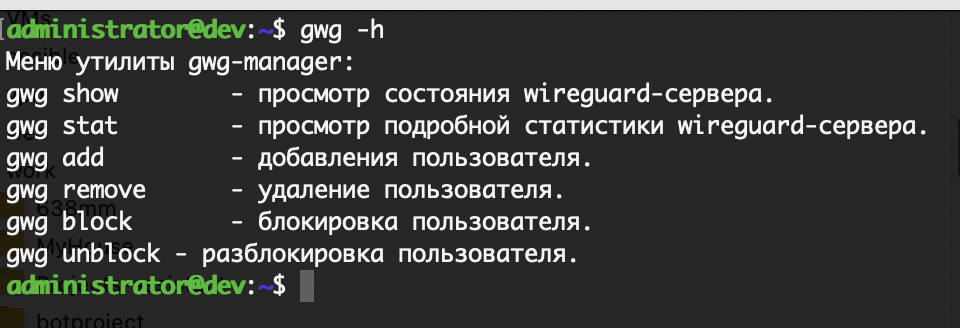
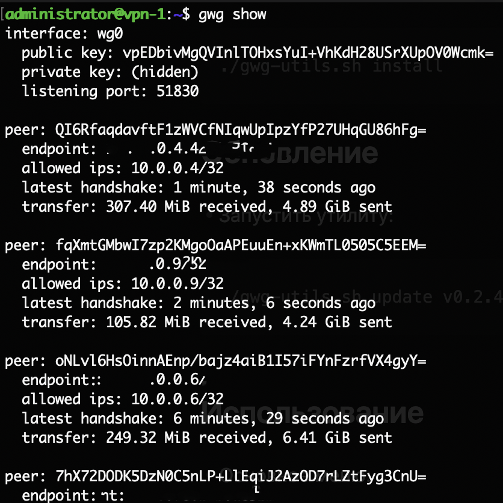
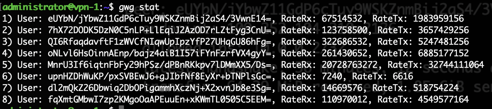
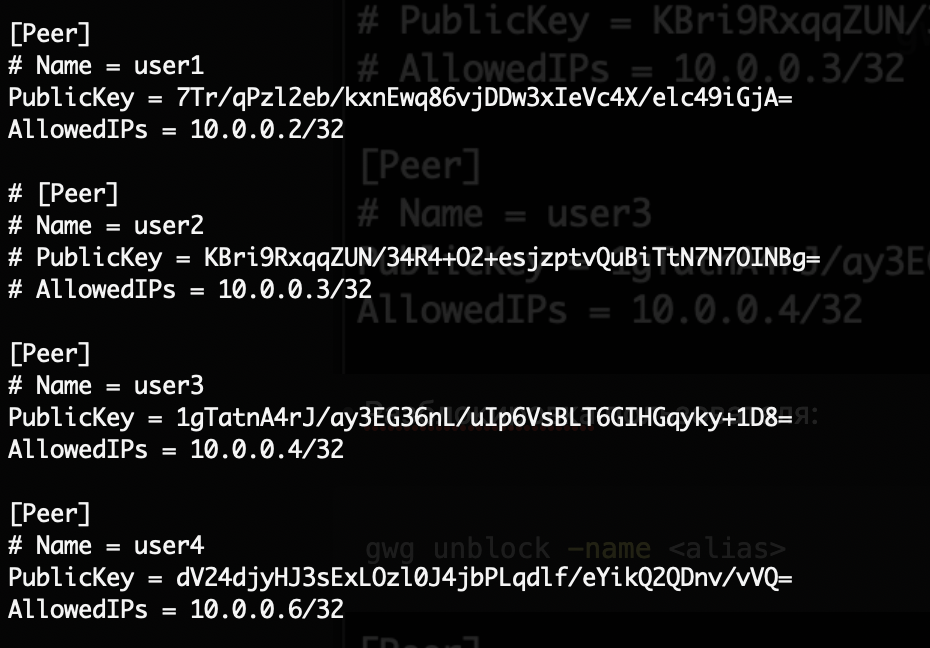
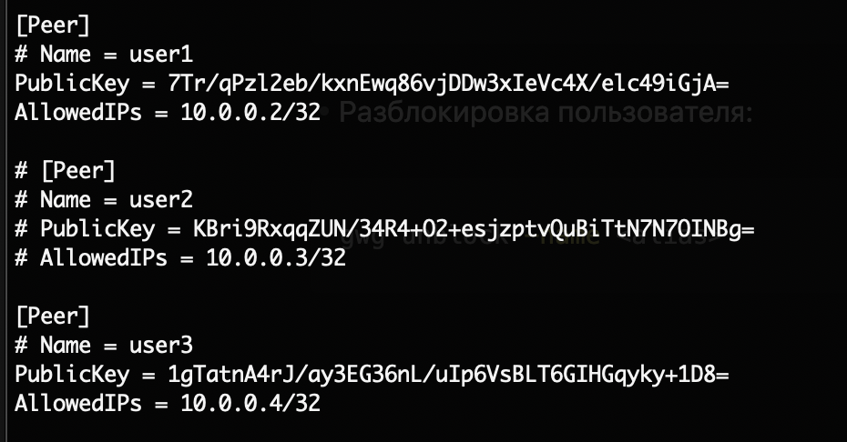
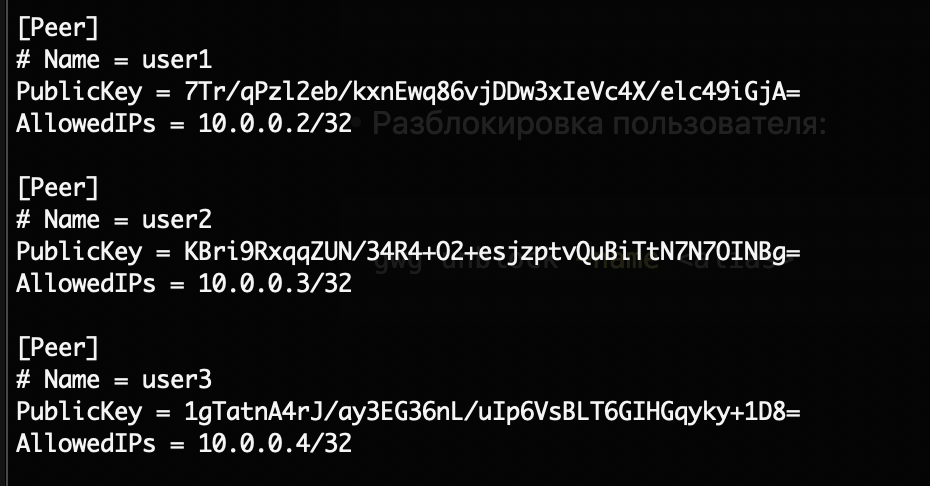

# go-wg-manager - менеджер Wireguard Server

---

## Для чего нужен

**gwg** - утилита командной строки для автоматического конфигурирования  и администрирования wireguard-сервера.
Поддерживает такие фунции как:

1) Автоматическая настройка конфигурации wireguard server;
2) Автоматическое изменение конфигурации сервера при добавлении пользователя;
3) Автоматическое изменение конфигурации сервера при удалении пользователя;
4) Автоматическое изменение конфигурации сервера при блокировке/разблокировке пользователя;
5) Просмотр состояния сервера через стандартную утилиту wg show;
6) Просмотр подробной статистики на основе стандартной утилиты wg show dump.

## Поддерживаемые платформы

- Любой дистрибутив linux на основе Debian.

## Установка

- Скачать архив с [желаемой](https://github.com/PavelMilanov/gwg/releases) версией и поддерживаемой архитектурой:

```bash
wget https://github.com/PavelMilanov/gwg/releases/download/v0.2.5/gwg.linux_amd64.tar
```

- Распаковать архив:

```bash
tar -xvf gwg-linux_amd64.tar
```

- Перенести исполняемый файл в директорию /usr/bin:

```bash
sudo cp gwg /usr/bin/
```

- Запустить установку:

```bash
./gwg init
```

## Обновление

- В разработке

## Использование

- Просмотр общего функионала:

```bash
gwg -h
```



- Просмотр состояния подключений:

```bash
gwg show
```



- Просмотр подробной статистики:

```bash
gwg stat
```



- Добавление пользователя:

```bash
gwg add -name <alias>
```



- Удаление пользователя:

```bash
gwg remove -name <alias>
```


- Блокировка пользователя:

```bash
gwg block -name <alias>
```



- Разблокировка пользователя:

```bash
gwg unblock -name <alias>
```


