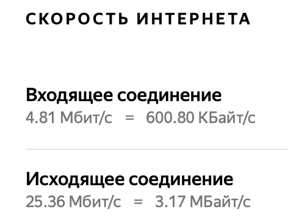
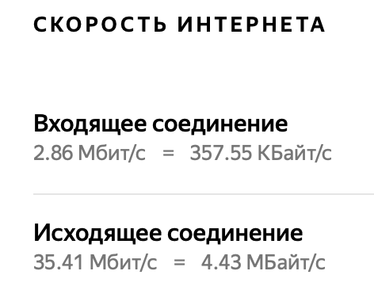

# gwg - менеджер Wireguard Server

---

## Для чего нужен

**gwg** - утилита командной строки для автоматического конфигурирования  и администрирования wireguard-сервера.
Поддерживает такие фунции как:

1) Автоматическая настройка конфигурации wireguard server;
2) Автоматическое изменение конфигурации сервера при добавлении пользователя;
3) Автоматическое изменение конфигурации сервера при удалении пользователя;
4) Автоматическое изменение конфигурации сервера при блокировке/разблокировке пользователя;
5) Просмотр состояния сервера через стандартную утилиту wg show;
6) Просмотр подробной статистики на основе стандартной утилиты wg show dump;
7) Создание общих правил для управления (ограничения скорости) входящим трафиком;
8) Создание правил для управления (ограничения скорости) входящим трафиком для каждого пользователя.

## Поддерживаемые платформы

- Любой дистрибутив linux на основе Debian.

## Установка

- Скачать `.deb`-пакет нужной версии и архитектуры со страницы
  [релизов](https://github.com/PavelMilanov/gwg/releases).

```bash
sudo apt install ./gwg_0.3.1-1_amd64.deb
```

- APT установит `gwg` и необходимые зависимости: `wireguard-tools`,
  `iproute2`, `iptables`, `procps`, `systemd` и `sudo`. Установка пакета не
  изменяет сетевую конфигурацию, не запускает WireGuard и не создает системного
  пользователя. Каталог `/etc/wireguard` остается доступен только `root`,
  поэтому административные команды выполняются через `sudo`.

- Пакет устанавливает Bash completion в
  `/usr/share/bash-completion/completions/gwg`. Рекомендуемый пакет
  `bash-completion` устанавливается APT по умолчанию; после установки откройте
  новую Bash-сессию.

- Инициализировать сервер отдельной командой:

```bash
sudo gwg init
```

`gwg init` создает конфигурацию сервера `wg0`, включает IPv4 forwarding и
запускает `wg-quick@wg0.service`.

Все команды, которые читают или изменяют `/etc/wireguard`, управляют
WireGuard-интерфейсами либо настройками TC, запускаются через `sudo`. Без `sudo`
доступны только справка, completion и просмотр версии.

Подробная документация по сборке и устройству пакета находится в
[`docs/debian-package.md`](./docs/debian-package.md).

Шаблоны серверной и клиентской WireGuard-конфигурации можно просматривать,
заменять и восстанавливать командами `gwg template`. Рабочие файлы находятся в
`/etc/wireguard/.wg_manager/templates`; список полей и порядок применения
описаны в [`docs/config-templates.md`](./docs/config-templates.md).

Исходный Go-модуль находится в каталоге [`src`](./src). Локальная сборка и
тестирование из корня репозитория выполняются командами `make build` и
`make test`.

## Сборка

Собрать обычный Go-бинарник с указанной версией:

```bash
make build version=0.3.1
./gwg version
```

Собрать Debian-пакет и передать эту же версию в Go-бинарник:

```bash
make deb version=0.3.1
```

Аргумент `version` встраивается в бинарник и выводится командой `gwg version`.
Он также задает Debian-поле `Version` и входит в имя `.deb`; команда `make deb`
не изменяет `debian/changelog`. Готовый пакет копируется в `vagrant/share`.
Для `version=dev` бинарник получает версию `dev`, а пакет — допустимую в Debian
версию `0~dev`, поэтому файл называется `gwg_0~dev_amd64.deb`.
Другой каталог можно указать через `DEB_OUTPUT_DIR`, например
`make deb version=0.3.1 DEB_OUTPUT_DIR=dist`. Make-сборка использует установленный
Go toolchain и отключает только предварительную проверку Debian Build-Depends
параметром `dpkg-buildpackage -d`. Подробности находятся в
[`docs/debian-package.md`](./docs/debian-package.md).

## Обновление

- Установить новый пакет поверх текущей версии:

```bash
sudo apt install ./gwg_NEW_VERSION_amd64.deb
```

Обновление бинарника не вызывает `gwg init` и не изменяет существующие ключи
или файлы в `/etc/wireguard`.

## Базовое  использование

### Просмотр общего функионала

- Синтаксис: `gwg -h`

```bash
gwg -h
Менеджер WireGuard-сервера

Usage:
  gwg [command]

Available Commands:
  completion  Generate the autocompletion script for the specified shell
  init        Подготовить систему и создать сервер wg0
  server      Управление WireGuard-сервером
  template    Управление шаблонами WireGuard
  tc          Управление ограничениями трафика
  user        Управление пользователями WireGuard
  version     Показать версии gwg и Go
```

### Просмотр состояния подключений

- Синтаксис: `sudo gwg server show`

```bash
sudo gwg server show

interface: wg0
  public key: 9zsArCzVC7kBWtvSkF4HBxSGlOvFU0StZSNvrXwVbAM=
  private key: (hidden)
  listening port: 51830

peer: 68upH1Bn0h1xy+Nuj61qtYRBGummuGBA2cU12xxbHiw=
  endpoint: 192.168.1.4:58082
  allowed ips: 10.0.0.2/32
  latest handshake: 15 minutes, 40 seconds ago
  transfer: 644.26 KiB received, 9.11 MiB sent
```

### Просмотр подробной статистики

- Синтаксис: `sudo gwg server stat`

```bash
sudo gwg server stat
1) User: test, Ip: 10.0.0.2/32 , Resieve: 659724, Sent: 9550044
```

### Добавление пользователя

- Синтаксис: `sudo gwg user add <alias>`

```bash
sudo gwg user add test2
____
[Peer]
# Name = test
PublicKey = 68upH1Bn0h1xy+Nuj61qtYRBGummuGBA2cU12xxbHiw=
AllowedIPs = 10.0.0.2/32

[Peer]
# Name = test2
PublicKey = 1RzC4fTiP84n1s9fKvh6YNQSgsFpdj3omlVD1JUwhSg=
AllowedIPs = 10.0.0.3/32
```

### Удаление пользователя

- Синтаксис: `sudo gwg user remove <alias>`

```bash
sudo gwg user remove test2
___
[Peer]
# Name = test
PublicKey = 68upH1Bn0h1xy+Nuj61qtYRBGummuGBA2cU12xxbHiw=
AllowedIPs = 10.0.0.2/32
```

### Блокировка пользователя

- Синтаксис: `sudo gwg user block <alias>`

```bash
sudo gwg user block test
___
# [Peer]
# Name = test
# PublicKey = 68upH1Bn0h1xy+Nuj61qtYRBGummuGBA2cU12xxbHiw=
# AllowedIPs = 10.0.0.2/32
```

### Разблокировка пользователя

- Синтаксис: `sudo gwg user unblock <alias>`

```bash
sudo gwg user unblock test
___
[Peer]
# Name = test
PublicKey = 68upH1Bn0h1xy+Nuj61qtYRBGummuGBA2cU12xxbHiw=
AllowedIPs = 10.0.0.2/32
```

## Модуль TC (Traffic Control)
___

#### Просмотр фунционала модуля

```bash
gwg tc -h
Описание: подсистема классификации трафика по разрешенной полосе пропускания.

gwg tc service - управление службой gwg traffic control.
gwg tc bandwidth - управление классами gwg traffic control.
gwg tc filter    - управление фильтрами gwg traffic control.

Помощь: gwg tc (service|bandwidth|filter) -h
```

### tc service

```bash
gwg tc service -h
Описание: tc service - управление службой gwg trafic control.

gwg tc service up      - включить службу (по-умолчанию выключена).
gwg tc service down    - выключииь службу.
gwg tc service restart - перечитать конфигурацию и перезапустить службу.
gwg tc service show    - посмотреть текущую конфигурацию службы.

Помощь: gwg tc service (up|down|restart|show) -h
```

#### Включение модуля с полосой пропускания

- Синтаксис: `sudo gwg tc service up --speed <скорость> --max-speed <максимальная скорость>`

```bash
sudo gwg tc service up --speed 5Mbit --max-speed 8Mbit
Classes not configured
Filters not configured
Tc config file generated successfully
Tc executable file generated successfully
Created symlink /etc/systemd/system/multi-user.target.wants/tc.service → /etc/systemd/system/tc.service.
Gwg tc service started
```



#### Выключение модуля TC

Синтаксис: `sudo gwg tc service down`

```bash
sudo gwg tc service down
Removed /etc/systemd/system/multi-user.target.wants/tc.service.
Gwg tc service down
```

Удаляет все правила `tc` и выключает службу `tc.service`

#### Перезапись конфигурации

Синтаксис: `sudo gwg tc service restart`
Необходима после изменения `tc bandwidth` или `tc filter`. Для применения изменений необходимо перезапустить службу.

```bash
sudo gwg tc service restart
Tc config file generated successfully
Tc executable file generated successfully
Gwg tc service restarted
```

#### Просмотр текущей конфигурации

Синтаксис: `sudo gwg tc service show`

```bash
sudo gwg tc service show
Gwg tc service:
	FullSpeed: 8Mbit
	Speed: 5Mbit
	Classes: []
	Filters: []
```

### Добавление правил

***Перед созданием правил ограничения трафика, необходимо создать саму полосу пропускания!***

### tc bandwidth

`gwg tc bandwidth` - абстракция над `tc class`, позволяющая создавать полосы пропускания

```bash
gwg tc bandwidth -h
Описание: tc bandwidth - классификатор для задания ограничения скорости.

gwg tc bandwidth add    - создать новый класс gwg traffic control.
gwg tc bandwidth remove - удалить класс gwg traffic control.
gwg tc bandwidth list   - просмотр существующих классов gwg traffic control.

Помощь: gwg tc bandwidth (add|remove|list) -h
```

#### Создание полосы пропускания

Синтаксис: `sudo gwg tc bandwidth add <название> --min <мин. скорость> --ceil <макс. скорость>`

```bash
sudo gwg tc bandwidth add regular --min 2Mbit --ceil 3Mbit
class: 2
	description: regular;
	min-rate: 2Mbit;
	cail-rate: 3Mbit;
Added successfully
```

#### Просмотр созданных полос пропускания

Синтаксис: `sudo gwg tc bandwidth list`

```bash
sudo gwg tc bandwidth list
class: 2
	description: regular;
	min-rate: 2Mbit;
	cail-rate: 3Mbit;

class: 20
	description: demo;
	min-rate: 20Mbit;
	cail-rate: 20Mbit;
```

#### Удаление полосы пропускания

Синтаксис: `sudo gwg tc bandwidth remove <class-id>`

```bash
sudo gwg tc bandwidth remove 20
class: 20
	description: demo;
	min-rate: 20Mbit;
	cail-rate: 20Mbit;
Removed successfully
```

### tc filter

`gwg tc filter` - управление правилами классификации пользовательского трафика.

#### Создание фильтра

Синтаксис: `sudo gwg tc filter add <описание> --class <class-id> --user <имя пользователя>`

```bash
sudo gwg tc filter add demo --class 2 --user test
filter: demo
	user: 10.0.0.2/32;
	class: 2;
Added successfully
```

#### Просмотр созданных фильтров

Синтаксис: `sudo gwg tc filter list`

```bash
sudo gwg tc filter list
filter: demo
	user: 10.0.0.2/32;
	class: 2;

filter: demo2
	user: 10.0.0.2/32;
	class: 2;
```

#### Удаление фильтра

Синтаксис: `sudo gwg tc filter remove <описание>`

```bash
sudo gwg tc filter remove demo2
filter: demo2
	user: 10.0.0.2/32;
	class: 2;
Removed successfully
```

После изменения `gwg tc bandwidth` и `gwg tc filter` необходимо перечитать конфигурацию: `sudo gwg tc service restart`.

```bash
sudo gwg tc service show
Gwg tc service:
	FullSpeed: 8Mbit
	Speed: 5Mbit
	Classes: [{2 regular 3Mbit 2Mbit}]
	Filters: [{demo 10.0.0.2/32 2}]
```


